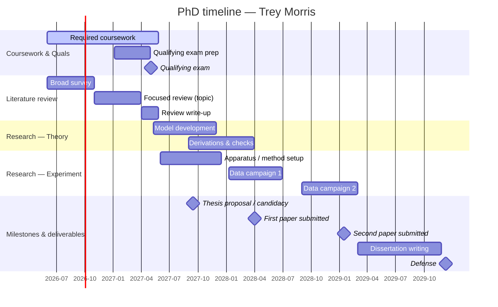

<!-- GENERATED by Planning/build_gantt.py from schedule.yaml — do not hand-edit. -->
<!-- Regenerate: uv run python Planning/build_gantt.py -->

# PhD timeline — Trey Morris — Gantt

See [schedule.yaml](schedule.yaml) for the source, [milestones.md](milestones.md) and [deliverables.md](deliverables.md) for detail.
